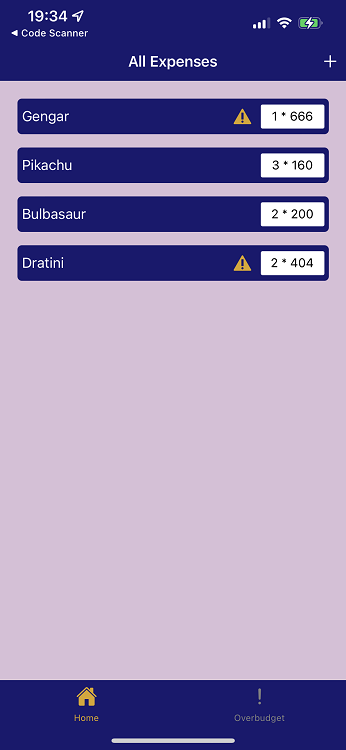
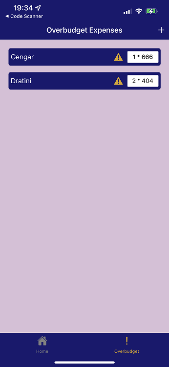
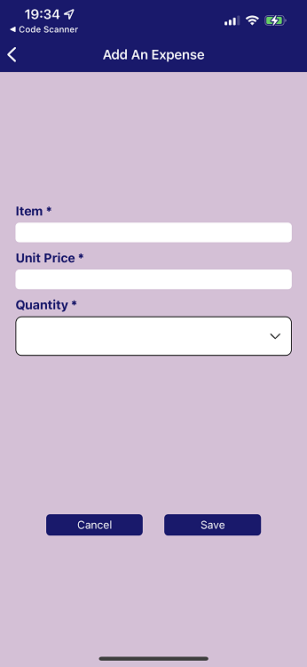
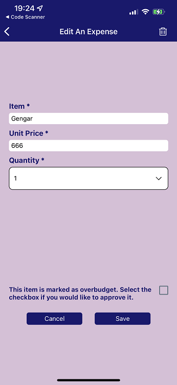

# Expense App

NEU CS5520 Fall 2023 - Mobile Dev Assignment 2

Kay (Mengxian) Cai

## App Introduction

An expense tracker app, which is connected to a firebase Firestore database. User can add, edit, delete and get expenses entries from database.

## Table of Contents

- [User Guide](#user-guide)
- [Getting Started](#getting-started)
  - [Prerequisites](#prerequisites)
  - [Firebase Configuration](#firebase-configuration)
  - [Create a .env file](#create-a-env-file)
  - [Installation](#installation)
- [Running the App](#running-the-app)

## User Guide

The app's home screen displays a list of all expense entries. An entry will be automatically marked as overbudget if the total expense for an entry is more than 500. User can navigate between the All Expenses screen and the Overbudget Expenses screen from the bottom tab bar.




From both All Expenses and Overbudget Expenses screens, user can navigate to Add An Expense screen by pressing on the + button on the top right of the screen. Add An Expense screen shows a form to the user to add an expense entry with item, unit price and quantity. After user press the save button and the inputs are validated, the entry will be saved into Firestore database and updated in the home screen.



Tapping each entry item in the list (on both All Expenses and Overbudget Expenses screens) navigate to an Edit screen. Changing any of the values and pressing the Save button will update the Firestore database and the lists on both screens accordingly. User can also delete an entry by pressing the dustbin icon on the top right of the screen



## Getting Started

### Prerequisites

Before you begin, ensure you have the following software installed on your machine:

- Node.js: [Download here](https://nodejs.org/)
- npm (Node Package Manager): Installed with Node.js

### Firebase Configuration

This project uses Firebase Firestore as the backend database. Follow these steps to set up Firebase for your app:

1. Create a Firebase project: [Firebase console](https://console.firebase.google.com/).
2. Navigate to the Cloud Firestore section and create a [Cloud Firestore database](https://firebase.google.com/docs/firestore/quickstart).
3. Obtain your Firebase configuration by navigating to Project Settings > General > Your apps > SDK setup and configuration.

Copy the configuration object.

### Create a .env file

Create a new file named `.env` in the root folder and paste the following, replacing the placeholder values with your Firebase credentials.

```javascript
// ExpensesApp/.env

apiKey = "YOUR_API_KEY";
authDomain = "YOUR_AUTH_DOMAIN";
projectId = "YOUR_PROJECT_ID";
storageBucket = "YOUR_STORAGE_BUCKET";
messagingSenderId = "YOUR_MESSAGING_SENDER_ID";
appId = "YOUR_APP_ID";
```

### Installation

1. Clone the repository.

```bash
git clone https://github.com/kaycaimx/ExpensesApp.git
```

2. Navigate to the project directory.

```bash
cd ExpensesApp
```

3. Install dependencies:

```bash
npm install
```

## Running the App

To run the app on an emulator or a physical device, use the following commands:

```bash
npm expo start
```
